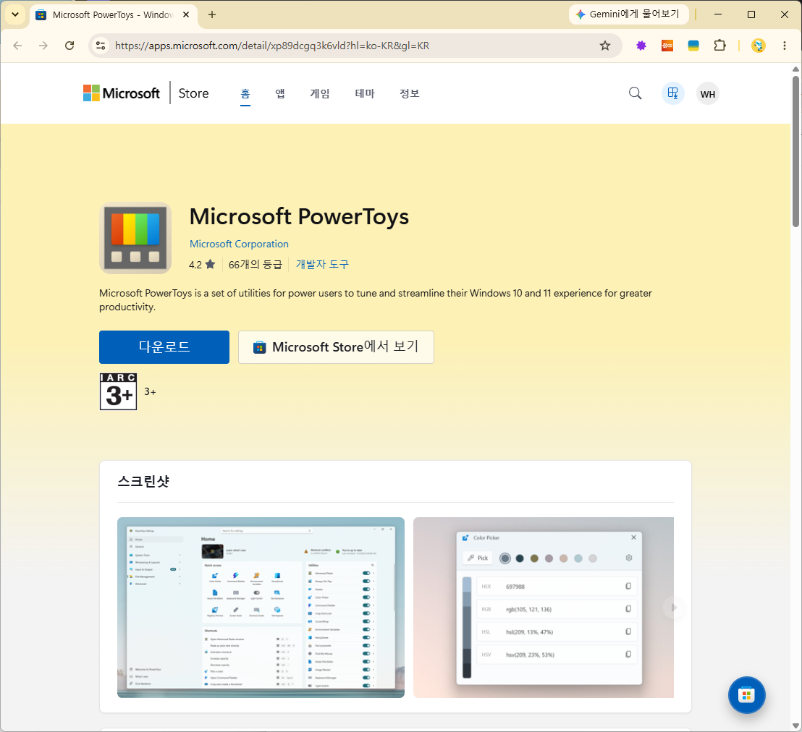
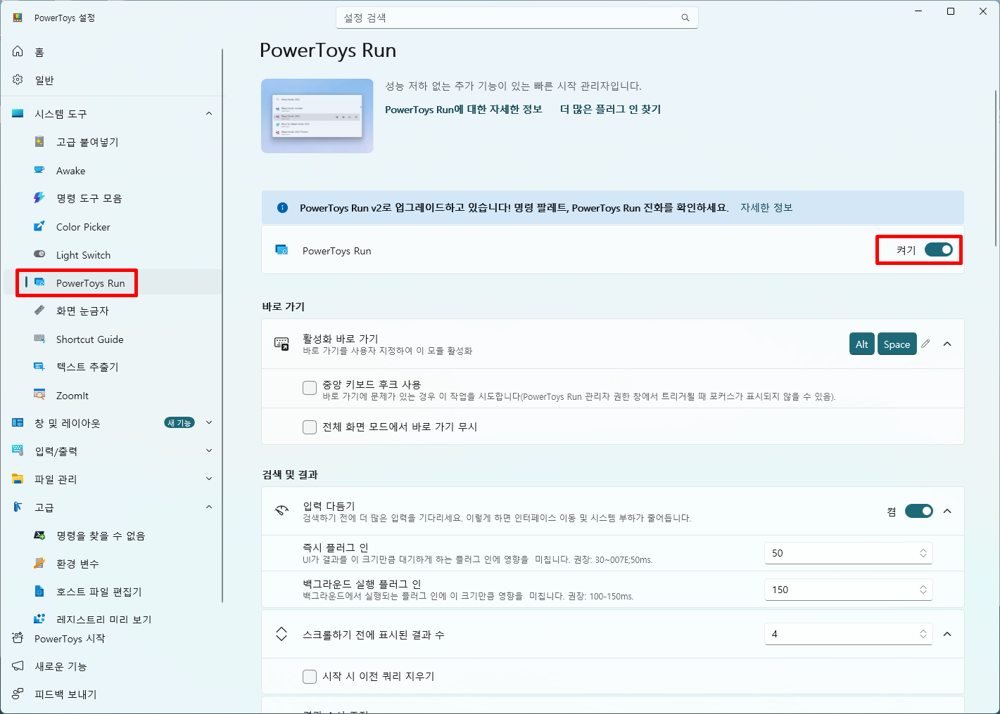
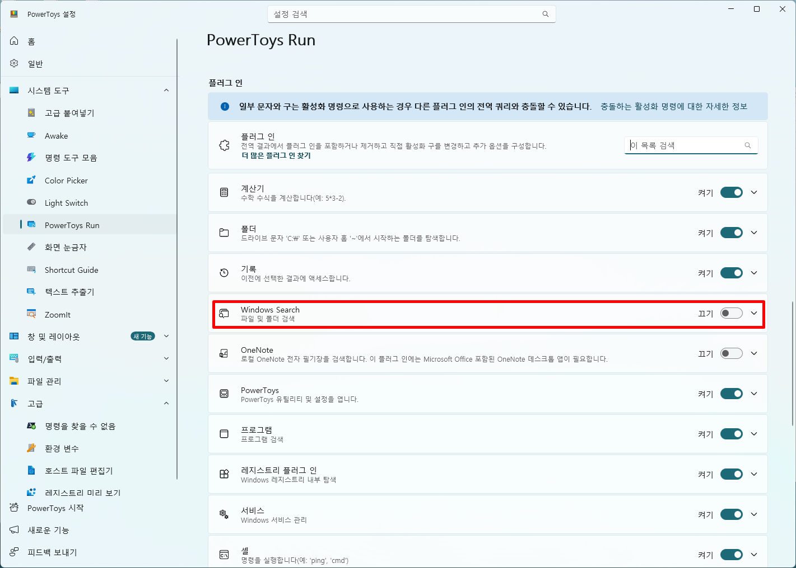
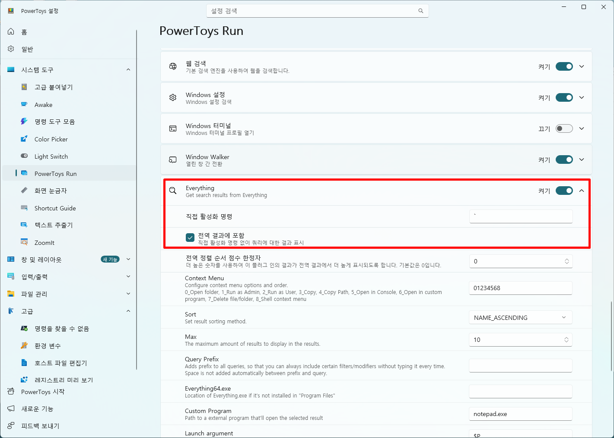

# Windows 생산성 극대화를 위한 필수 도구: Microsoft PowerToys 활용 가이드

## 실행 환경 및 요구 사항

본 가이드의 작성 및 테스트 환경은 다음과 같다.

- **운영체제(OS)**: Windows 11 Pro 64-bit (Windows 10 v2004 이상 지원)
- **대상 소프트웨어**: Microsoft PowerToys 최신 버전
- **설치 도구**: Windows Package Manager(winget) 또는 Microsoft Store

---

## 작업 효율을 획기적으로 개선하는 Windows 도구

소프트웨어 개발과 문서 작업 환경에서 창 배치, 빠른 앱 검색, 화면 내 색상 및 텍스트 추출은 일상적으로 반복되는 작업이다. 그러나 Windows 기본 환경만으로는 다중 모니터 작업 시 복잡한 창 분할이나 서식 없는 텍스트 붙여넣기와 같은 세밀한 편의 기능을 신속하게 처리하기 어렵다.

**Microsoft PowerToys**는 마이크로소프트가 주도하는 오픈소스 프로젝트로, 시스템 수준에서 생산성을 끌어올리는 유틸리티 모음이다. 서드파티 프로그램을 무분별하게 설치할 필요 없이 검증된 도구 세트를 통해 단축키 중심의 빠르고 쾌적한 개발 워크플로를 구축할 수 있다.

---

## 1. Microsoft PowerToys 설치 방법

PowerToys는 공식 Microsoft Store 또는 패키지 관리자인 `winget`을 통해 안전하고 빠르게 설치할 수 있다.

### 1-1. CLI(winget)를 통한 명령줄 설치

명령 프롬프트(CMD) 또는 PowerShell을 실행한 후 다음 명령어를 입력한다.

```powershell
# Microsoft PowerToys 자동 설치
winget install Microsoft.PowerToys --source winget
```

### 1-2. GUI(Microsoft Store)를 통한 설치

웹 브라우저를 통해 [Microsoft Store 내 Microsoft PowerToys 다운로드 페이지](https://apps.microsoft.com/detail/xp89dcgq3k6vld?hl=ko-KR&gl=KR)에 접속하여 다운로드하거나, Windows 스토어 앱에서 직접 설치할 수 있다.



1. **Microsoft Store** 앱을 실행하거나 위 웹 페이지 링크로 이동한다.
2. 상단 검색창에 **Microsoft PowerToys**를 검색하거나 상세 페이지를 연다.
3. 제품 페이지에서 **다운로드** 버튼을 클릭하여 설치를 완료한다.

설치가 완료되면 백그라운드 프로세스로 상주하며, 시스템 트레이에서 세부 설정을 직접 제어할 수 있다.

---

## 2. 개발 및 일상 업무를 위한 핵심 유틸리티

PowerToys가 제공하는 수많은 유틸리티 중 생산성 체감 효과가 가장 큰 대표 기능들은 다음과 같다.

| 기능명 | 기본 단축키 | 주요 용도 및 특징 |
| :--- | :--- | :--- |
| **FancyZones** | `Win + Shift + \`` | 모니터 화면을 사용자 정의 그리드로 분할하여 창을 즉시 정렬 |
| **PowerToys Run** | `Alt + Space` | 빠른 프로그램 실행, 파일 검색, 계산기 및 단위 변환 수행 |
| **Always on Top** | `Win + Ctrl + T` | 특정 창을 다른 창들의 최상단에 항상 고정 |
| **Text Extractor** | `Win + Shift + T` | 이미지나 선택 불가능한 화면 영역에서 OCR을 통해 텍스트 복사 |
| **Color Picker** | `Win + Shift + C` | 마우스 커서가 위치한 화면 픽셀의 색상 코드(HEX, RGB 등) 추출 |
| **Paste as Plain Text** | `Win + Ctrl + Alt + V` | 서식(HTML, 폰트 스타일 등)을 제거한 순수 텍스트만 붙여넣기 |
| **ZoomIt** | `Ctrl + 1` (확대), `Ctrl + 2` (그리기) | 화면 영역 즉시 확대 및 프레젠테이션용 실시간 화면 위 주석/드로잉 |

### 2-1. 복잡한 멀티태스킹을 위한 화면 제어: FancyZones와 Always on Top

대화면 모니터나 듀얼 모니터 환경에서 여러 작업 창을 띄울 때 기본 Windows Snap 기능은 고정된 비율만 지원하여 한계가 있다.

- **FancyZones**: 복잡한 레이아웃(3단 세로 분할, 2x2 격자 등)을 미리 템플릿으로 저장한 뒤, `Shift` 키를 누른 채 창을 드래그하면 원하는 영역에 오차 없이 창이 밀착된다.
- **Always on Top**: 디버깅 로그 모니터링 창, 메모장, 또는 참조용 문서를 작업 창 위에 띄워두어야 할 때 창을 즉시 최상단에 고정하여 컨텍스트 스위칭 비용을 줄여준다.

### 2-2. 마우스 사용을 최소화하는 키보드 중심 워크플로: PowerToys Run

`Alt + Space` 단축키로 호출되는 **PowerToys Run**은 macOS의 Spotlight나 Raycast와 유사한 빠른 런처 기능을 제공한다.

- 시스템 전역 파일 검색 및 앱 실행이 즉각적으로 이루어진다.
- 별도의 프로그램을 열지 않고도 수식 계산, 단위 변환, 시간 확인 등의 작업을 즉시 수행할 수 있다.
- 쉘 명령어 실행, 열려 있는 프로세스 전환 등의 확장 플러그인을 기본 내장하고 있다.

### 2-3. 데이터 추출 및 전처리 편의 기능: Color Picker와 Text Extractor

- **Color Picker**: 웹 프론트엔드 퍼블리싱이나 UI 디자인 검토 시 화면의 임의 지점에 커서를 대고 색상 코드를 클립보드로 직접 복사한다.
- **Text Extractor**: 복사가 금지된 웹 페이지나 스크린샷 이미지 내의 글자를 OCR 기술로 즉시 인식하여 텍스트 데이터로 변환한다.

### 2-4. 화면 시연 및 프레젠테이션 도구: ZoomIt

Sysinternals의 인기 도구였던 **ZoomIt**이 PowerToys에 공식 통합되어 별도의 추가 설치 없이 사용할 수 있다.

- **화면 확대(`Ctrl + 1`)**: 코드 리뷰나 원격 회의, 기술 세미나 진행 시 특정 코드 블록이나 UI 영역을 즉각 확대하여 가독성을 높인다.
- **실시간 주석 및 드로잉(`Ctrl + 2`)**: 화면 위에 자유 곡선, 직선, 사각형, 화살표 등을 그리며 설명 포인트를 명확하게 시각화한다.

---

## 3. Everything 초고속 검색 플러그인 연동 및 단독 앱 활용 가이드

PowerToys Run은 기본적으로 Windows Search 색인 서비스를 활용하므로, 대용량 파일 검색 시 속도가 느리거나 일부 경로의 파일이 누락되는 한계가 있다. 이를 보완하기 위해 초고속 검색 엔진인 **Everything**을 플러그인으로 연동하거나, 독립 프로그램으로 설치하여 활용할 수 있다.

### 3-1. PowerToys Run에 Everything 플러그인 연동하기

오픈소스 커뮤니티 플러그인(`lin-ycv/EverythingPowerToys`)을 통해 PowerToys Run 검색창에서 Everything의 즉각적인 색인 기능을 직접 호출할 수 있다.

#### 1단계: 플러그인 설치
PowerShell 또는 터미널을 실행하여 Everything 플러그인을 설치한다.

```powershell
# Everything 플러그인 패키지 설치
winget install lin-ycv.EverythingPowerToys
```

설치 후 작업 표시줄 우측 트레이의 PowerToys 아이콘을 우클릭하여 프로그램을 완전히 종료(Exit)한 뒤 다시 실행한다.

#### 2단계: PowerToys Run 활성화 확인
PowerToys 설정 창을 열고, 좌측 **[시스템 도구]** 메뉴에서 **[PowerToys Run]**을 선택한 뒤 모듈이 **[켜기]** 상태인지 확인한다.



#### 3단계: 기본 Windows Search 플러그인 비활성화
화면 하단의 **플러그 인** 목록으로 이동하여 기존 **Windows Search** 플러그인을 **[끄기]**로 전환한다. 이는 동일한 파일이 중복으로 검색되는 현상을 방지하고 검색 지연 시간을 없애기 위한 필수 작업이다.



#### 4단계: Everything 플러그인 활성화 및 전역 결과 포함
플러그 인 목록에서 **Everything**을 찾아 **[켜기]**로 활성화한 후 드롭다운을 펼친다. **[전역 결과에 포함]** 체크박스를 활성화하면 별도의 접두 기호 없이도 `Alt + Space` 검색창에서 바로 파일 검색이 수행된다.



#### 5단계: 사용 방법
- 단축키 `Alt + Space`를 눌러 검색창을 호출한다.
- 파일명이나 확장자를 입력하면 Everything 색인을 통해 지연 없이 즉시 검색 결과가 노출된다.

---

### 3-2. Everything 단독 프로그램 설치 및 활용

검색 결과를 날짜순·크기순으로 정밀하게 정렬하거나, 대량의 파일 관리 작업을 수행할 때는 Everything을 독립 앱으로 실행하는 것이 훨씬 강력하다.

#### 1단계: 단독 애플리케이션 설치
CLI 환경에서 다음 명령어를 입력하여 Voidtools 공식 Everything 프로그램을 설치한다.

```powershell
# Everything 단독 애플리케이션 설치
winget install voidtools.Everything
```

#### 2단계: 필수 초기 설정
- **Everything 서비스 설치**: 설치 옵션 또는 `도구` -> `설정`에서 서비스를 활성화하여 UAC(관리자 권한) 확인 창 없이 백그라운드 색인을 유지한다.
- **시스템 시작 시 실행**: 부팅과 동시에 트레이 아이콘으로 상주하도록 설정한다.

#### 3단계: 전역 호출 단축키 지정
어디서나 단독 창을 즉시 띄울 수 있도록 단축키를 등록한다.
1. Everything 창에서 `Ctrl + P`를 눌러 설정으로 진입한다.
2. **[키보드]** 메뉴에서 **[새 창 바로 가기 키]**에 원하는 단축키(예: `Ctrl + Shift + F` 또는 `Alt + S`)를 등록하고 적용한다.

#### 4단계: 주요 검색 문법 예시
- **확장자 필터**: `*.pdf`, `*.tsx`
- **AND 검색(공백)**: `manual 2026`
- **OR 검색(`|`)**: `*.jpg | *.png`
- **폴더 한정 검색**: `folder:project`

---

## 4. 권장 설정 및 성능 최적화 팁

PowerToys는 다수의 백그라운드 모듈로 구성되어 있으므로, 불필요한 리소스 낭비를 막고 충돌을 방지하기 위해 다음 설정을 권장한다.

1. **사용하지 않는 모듈 비활성화**: 전체 유틸리티를 모두 켜둘 필요가 없다. 설정 메뉴에서 본인의 작업에 필요하지 않은 기능(예: Video Conference Mute 등)은 비활성화하여 시스템 메모리를 절약한다.
2. **관리자 권한 실행 활성화**: 특정 관리자 권한으로 실행된 소프트웨어(에디터, 터미널 등) 위에서 단축키가 작동하지 않는 현상을 방지하려면, PowerToys 일반 설정에서 **항상 관리자 권한으로 실행** 옵션을 켜두어야 한다.
3. **단축키 충돌 점검**: IDE나 그래픽 툴의 전역 단축키와 겹치는 기능이 있다면, 해당 유틸리티 설정 페이지에서 바로가기 키를 자신만의 키 조합으로 재할당한다.

---

## 5. 결론 및 요약

- **Microsoft PowerToys**는 Windows 환경에서 부족했던 창 분할, 전역 런처, 텍스트 및 색상 추출 기능을 보완하는 공식 오픈소스 도구 모음이다.
- **Everything 플러그인 연동**을 통해 기본 Windows Search의 한계를 극복하고 초고속 전역 파일 검색 환경을 구성할 수 있다.
- 필요 없는 모듈을 비활성화하고 관리자 권한으로 상주시키는 설정을 적용하면 시스템 리소스 소모 없이 쾌적한 개발 환경을 유지할 수 있다.

현재 Windows 환경에서 반복적인 창 정렬이나 느린 파일 검색으로 불편을 겪고 있다면, 지금 바로 PowerToys와 Everything을 설치하여 워크플로에 도입해 보길 권장한다. 여러분의 생산성을 가장 크게 끌어올린 유틸리티 조합이 있다면 함께 의견을 나누어 볼 수 있다.

---

## 참고 자료 (References)

- Microsoft PowerToys 공식 문서: https://learn.microsoft.com/ko-kr/windows/powertoys/
- Microsoft PowerToys GitHub 저장소: https://github.com/microsoft/PowerToys
- Microsoft Store 공식 다운로드 페이지: https://apps.microsoft.com/detail/xp89dcgq3k6vld?hl=ko-KR&gl=KR
- Everything 공식 웹사이트: https://www.voidtools.com/
- EverythingPowerToys GitHub 저장소: https://github.com/lin-ycv/EverythingPowerToys
