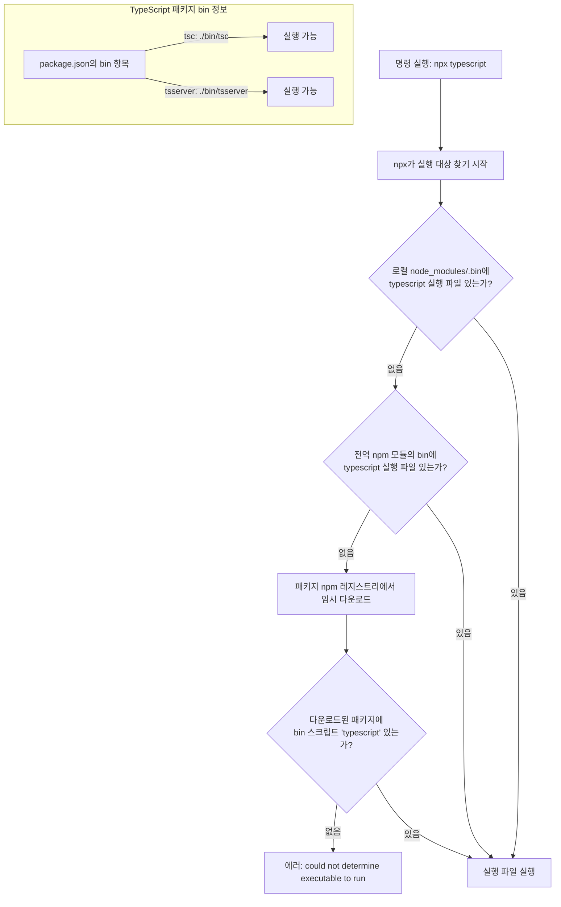

# npm과 npx의 차이점과 사용법

## 1. 개요

### 1-1. 정의

- **npm**
  Node Package Manager의 약자로, Node.js 환경에서 패키지를 설치, 업데이트, 삭제, 관리하는 도구이다. Node.js를 설치하면 기본적으로 함께 설치된다.
- **npx**
  Node Package Execute의 약자로, Node.js 환경에서 패키지를 실행하는 도구이다. npm 5.2.0 이상 버전에 기본 포함되어 있으며, 설치된 패키지 또는 원격 패키지를 바로 실행할 수 있다.

## 2. 차이점

### 2-1. 역할 비교

- npm

  - 주된 역할은 패키지를 **관리**하는 것이다.
  - 프로젝트 로컬 또는 전역에 설치하여 사용한다.

  ```bash
  # lodash 패키지 설치
  npm install lodash

  # 전역 설치
  npm install -g typescript

  # 패키지 삭제
  npm uninstall lodash
  ```

- npx

  - 주된 역할은 패키지를 **실행**하는 것이다.
  - 로컬 또는 전역 설치된 패키지를 실행하거나, 설치 없이 원격에서 바로 실행할 수 있다.

  ```bash
  # 로컬에 설치된 create-react-app 실행
  npx create-react-app my-app

  # 설치 없이 일회성 실행
  npx cowsay "Hello World"
  ```

## 3. 동작 원리

### 3-1. 실행 파일 탐색 과정

npx는 패키지 이름이 아니라 CLI 실행 파일을 탐색한다.
예를 들어, `npx typescript --version` 명령은 `typescript`라는 실행 파일을 찾지만, TypeScript 패키지에는 해당 이름의 실행 파일이 존재하지 않아 오류가 발생한다. TypeScript의 실제 CLI 실행 파일 이름은 `tsc`와 `tsserver`이다.



## 4. 사용 예시

### 4-1. TypeScript 버전 확인

- 로컬 설치 후 실행

  ```bash
  npm install typescript --save-dev
  npx tsc --version
  ```

- 전역 설치 후 실행

  ```bash
  npm install -g typescript
  tsc --version
  ```

- 전역 설치 없이 최신 버전 실행

  ```bash
  npx tsc --version
  ```

## 5. 핵심 요약

### 5-1. 비교 표

| 구분           | npm                 | npx                           |
| -------------- | ------------------- | ----------------------------- |
| 주 기능        | 패키지 관리         | 패키지 실행                   |
| 설치 필요 여부 | 필요                | 필요 없음(원격 실행 가능)     |
| 실행 대상      | 설치된 패키지       | 설치된 패키지 + 원격 패키지   |
| 사용 예        | `npm install react` | `npx create-react-app my-app` |

## 6. 결론

npm과 npx는 모두 Node.js 생태계에서 중요한 역할을 담당하는 도구이다. npm은 패키지를 관리하는 데 특화되어 있고, npx는 패키지를 실행하는 데 특화되어 있다. 특히 npx를 활용하면 전역 설치 없이도 최신 버전의 CLI를 실행할 수 있으므로, 불필요한 전역 패키지 설치를 줄이고 환경을 깔끔하게 유지할 수 있다.
