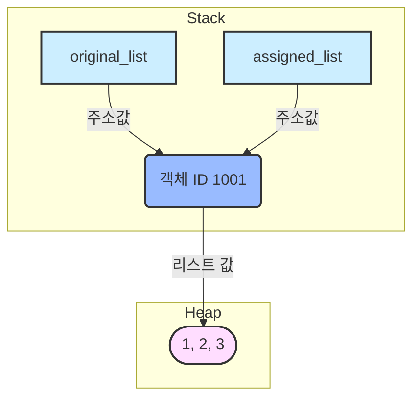
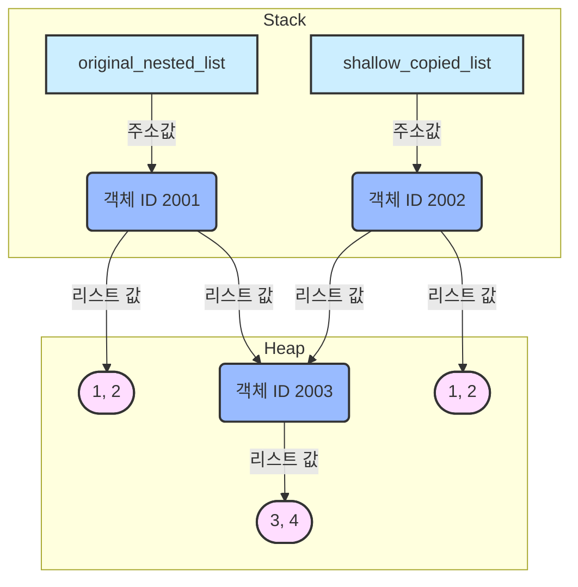
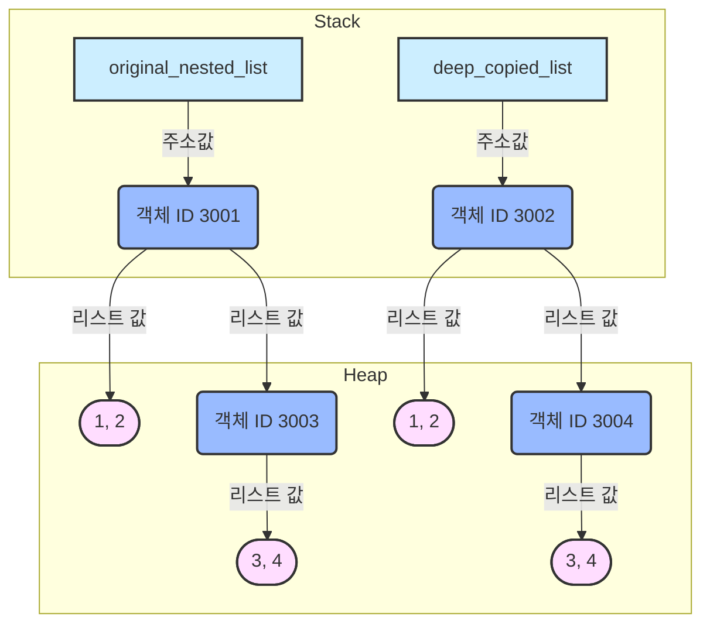

## 1\. 참조 할당 (Reference Assignment) 메모리 구조

**설명:**

- **스택(Stack)**: `original_list`와 `assigned_list`라는 두 변수가 존재한다.
- **힙(Heap)**: `[1, 2, 3]`이라는 리스트 객체가 생성되고 고유한 ID(예: 1001)를 가진다.
- **참조**: 두 변수 `original_list`와 `assigned_list`는 **동일한 ID 1001을 가진 리스트 객체**를 가리킨다. 즉, 메모리에 리스트 객체는 하나만 존재한다.

---

## 2\. 얕은 복사 (Shallow Copy) 메모리 구조

**설명:**

- **스택(Stack)**: `original_nested_list`와 `shallow_copied_list`라는 두 변수가 존재한다.
- **힙(Heap)**:
  - `original_nested_list`는 ID 2001의 리스트 객체를 가리킨다. 이 객체는 `1`, `2`와 함께 ID 2003의 중첩 리스트 `[3, 4]`를 참조한다.
  - `shallow_copied_list`는 ID 2002의 **새로운 리스트 객체**를 가리킨다.
  - 하지만 이 새로운 리스트 객체(ID 2002) 역시 `1`, `2`와 함께 **원본과 동일한 ID 2003의 중첩 리스트 `[3, 4]`를 참조**한다.
- **참조**: 외부 리스트(`original_nested_list`와 `shallow_copied_list`)는 서로 다른 객체를 가리키지만, **내부의 가변 객체(`[3, 4]`)는 두 리스트가 공유**한다.

---

## 3\. 깊은 복사 (Deep Copy) 메모리 구조

**설명:**

- **스택(Stack)**: `original_nested_list`와 `deep_copied_list`라는 두 변수가 존재한다.
- **힙(Heap)**:
  - `original_nested_list`는 ID 3001의 리스트 객체를 가리키며, 이 객체는 ID 3003의 중첩 리스트 `[3, 4]`를 참조한다.
  - `deep_copied_list`는 ID 3002의 **완전히 새로운 리스트 객체**를 가리킨다. 이 새로운 객체는 ID 3004의 **새로운 중첩 리스트 `[3, 4]`를 참조**한다.
- **참조**: 원본과 복사본의 외부 리스트(`original_nested_list`, `deep_copied_list`)뿐만 아니라, **내부의 중첩 리스트까지도 서로 다른 독립적인 객체를 참조**한다.
